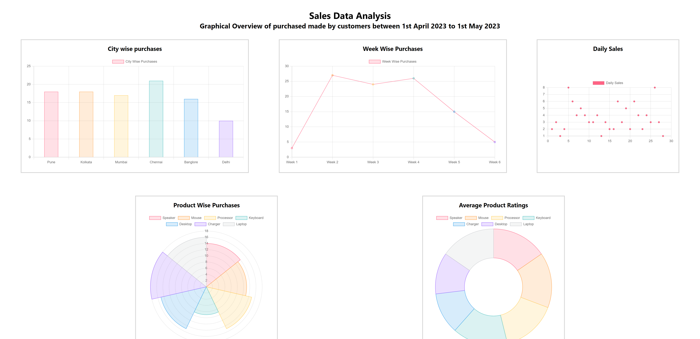

# Sales Data Analysis

This frontend application provides a graphical overview of purchases made by customers between 1st April 2023 to 1st May 2023.

## Page Structure

The frontend page provides graphical representation for the following aspects of sales data:

1. **City Wise Purchases**
   - Graphical representation using vertical Bar Graph for city wise purchases made by customers.

2. **Week Wise Purchases**
   - Graphical overview using Line graph to demonstrate purchases made each week between 1st April to 1st May 2023.

3. **Daily Sales**
   - Scatter chart representing daily sales data.

4. **Product Wise Purchases**
   - Donut chart displaying the distribution of purchases across different products.

5. **Average Product Ratings**
   - Pie chart showing the average ratings for various products.

## Libraries Used

- **Chart.js:** A popular JavaScript library for creating interactive charts and graphs. The charts on this page are powered by Chart.js.

## How to Use

1. Spin up the server by following the instructions in the backend directory. 

2. Open the HTML file in a web browser.

3. View the graphical representation of sales data based on the categories mentioned above.

## Chart.js

The charts are rendered using Chart.js, a powerful and flexible JavaScript charting library. For more information about Chart.js and its usage, visit the [Chart.js Documentation](https://www.chartjs.org/docs/latest/).

## Author

Vighnesh Manjrekar

## Demo

